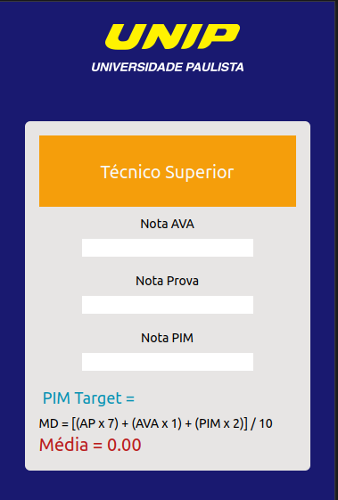
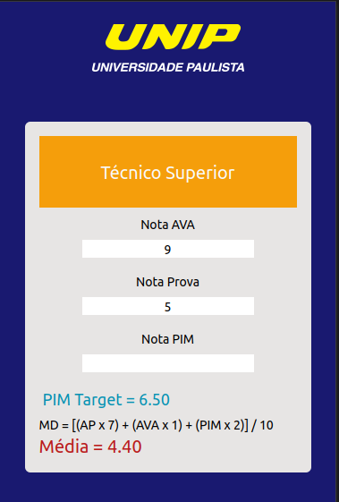
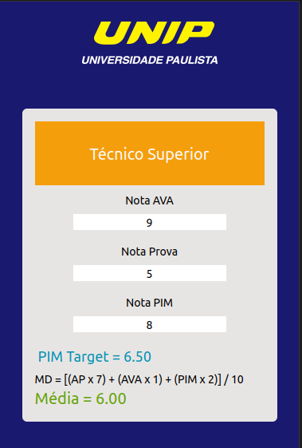

# Calculadora-Unip

Simulador de calculo de médias para cursos da modalidade Técnico Superior.

  
  
  

### Tecnologias utilizadas:

    
    
    

### Descrição do projeto:

Digite a nota final das atividades do ambiente virtual (AVA), em seguida, digite a nota da prova. Caso as duas notas sejam insuficientes para uma média mínima, o PIM Target irá sugerir qual nota deve ser alcançada no PIM para obter aprovação.
Caso já tenha a nota do PIM, basta digita-la no campo para ter o calculo da média final.
Formula para o calculo:  
MD = [(AP x 7) + (AVA x 1) + (PIM x 2)] / 10

#
